# Improving LLM Effectiveness in Long-Context Workflows

## 1. Problem Statement: Reduced Effectiveness in Long Contexts

Although modern Large Language Models (LLMs) technically support large context
windows, [research](https://arxiv.org/pdf/2307.03172) and empirical evidence
show that model performance degrades as context length increases.

Key contributing factors include:

- **Reasoning Overload**: More tokens increase the cognitive load required for
  inference.

- **Position Bias**:
  - **Primacy bias**: higher effectiveness when relevant information appears
    early.
  - **Recency bias**: higher effectiveness when relevant information appears
    late.

- **“Lost in the Middle” Effect**: Accuracy drops when key information appears
  mid-context.

- **Information Dilution**: Irrelevant data reduces the signal-to-noise ratio.

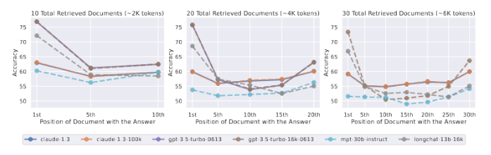

### Long-Context Failure Modes

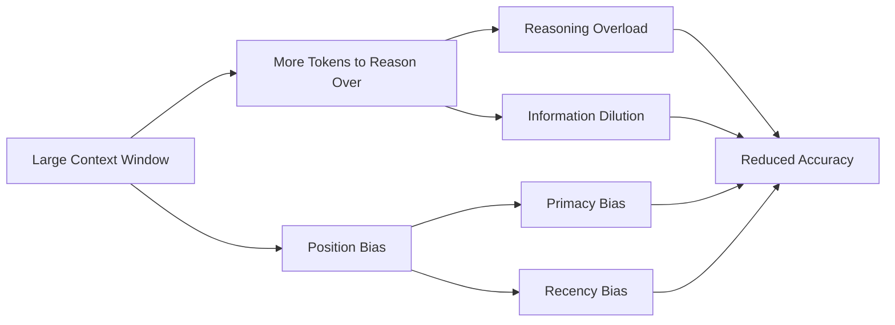

## 2. Core Design Principle: Signal-to-Noise Ratio

Effective long-context systems should prioritize:

- **Maximizing Signal-to-Noise Ratio (SNR)** in each API call.
- **Maintaining Persistence of Reasoning** across multiple calls.

Rather than sending large raw contexts, the system must actively select and
structure information.

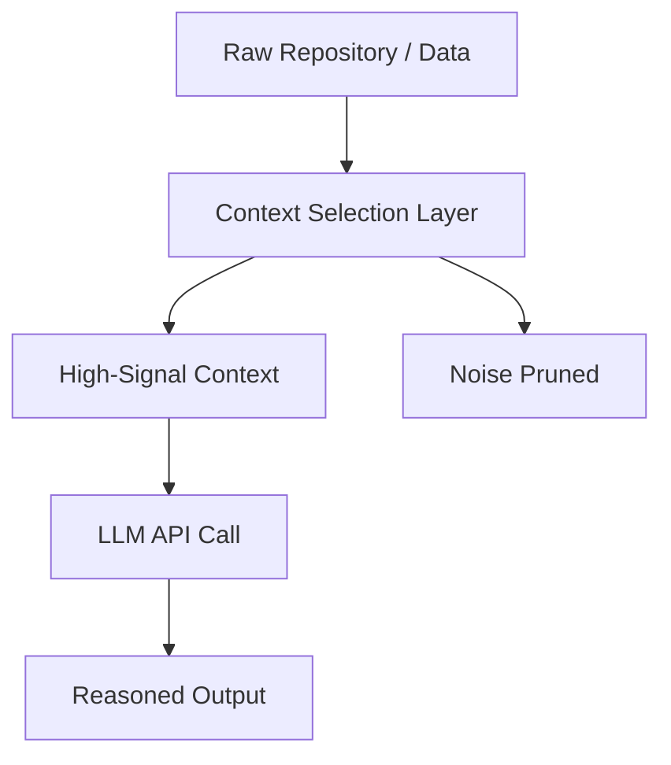

## 3. Context Construction Strategies

### 3.1 File-by-File Analysis

**Approach** One API call per file in the repository.

**Pros**

- Simple to implement.
- Minimal engineering overhead.

**Cons**

- Incomplete context.
- Cross-file dependencies are missing.
- Limited global reasoning.

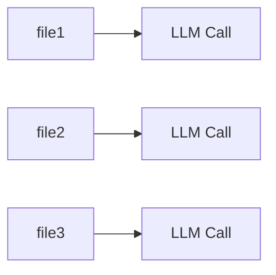

### 3.2 Entry Point Analysis (Internal Call Expansion)

**Approach** Use libraries like
[tree-sitter](https://tree-sitter.github.io/tree-sitter/) to start from an entry
point (e.g., public function, CLI command) and include all internally called
functions and definitions in a single context.

**Challenges**

- Dynamic dispatch and polymorphism are difficult to resolve statically.
- Context size can grow quickly in large codebases.

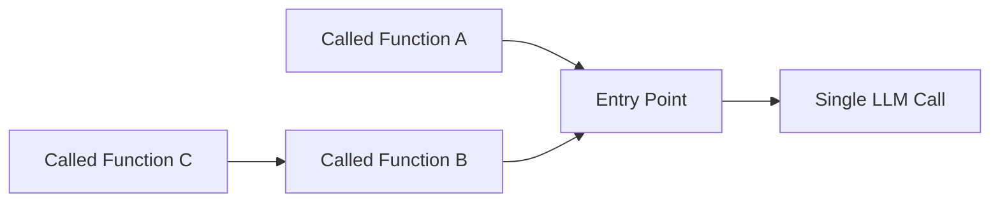

### 3.3 Autonomous Agents & Agent–Computer Interfaces (ACI)

**Approach** Instead of sending large static contexts, an autonomous agent
interacts with the filesystem using LM-friendly commands.

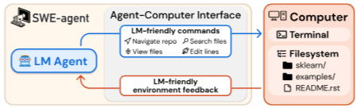

This mirrors how a human auditor works: explore, inspect, reason, and iterate.

**SWE-agent Insights**: Documentation from the
[SWE-agent project](https://arxiv.org/pdf/2405.15793) provides key
implementation details to save development time:

- Limit file views to optimal line ranges.
- Prune success/error messages aggressively.
- Prefer many small, focused calls over a few large ones.

**Recommended Auditing Commands**

- get_entry_points()
- read_code(fn_name)
- get_callers(fn_name)
- find_usage(variable_name)

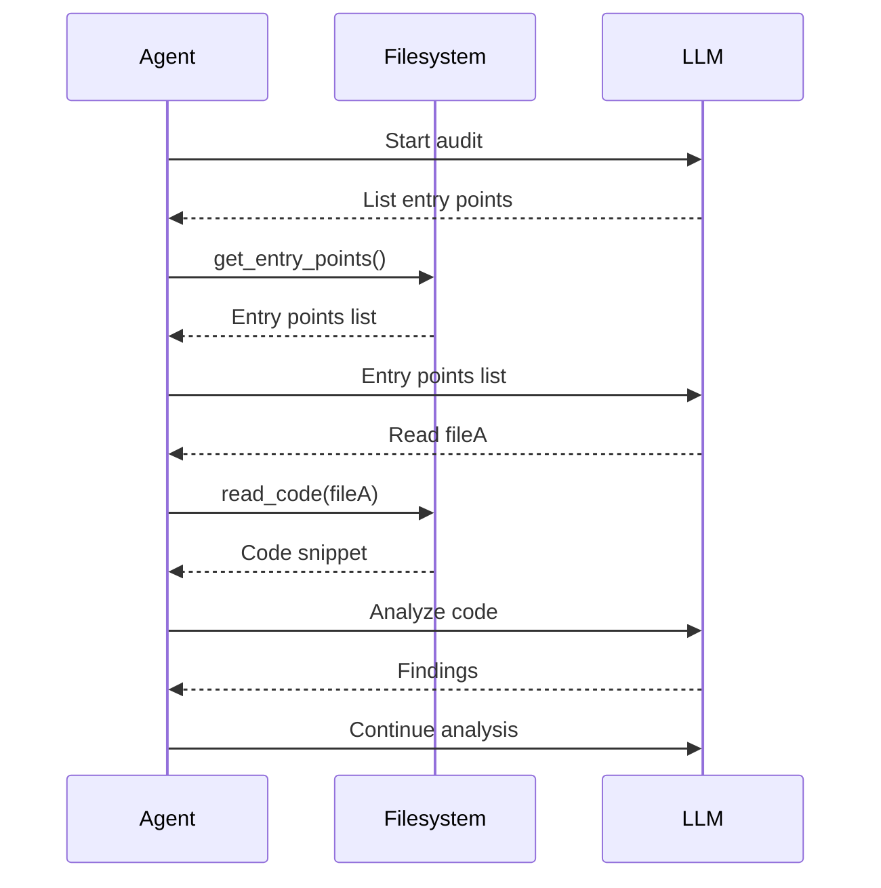

## 4. Graph-Based Repository Understanding

### 4.1 Repository Graphs

**[RepoGraph](https://arxiv.org/pdf/2410.14684)-style approaches** model the
repository as a dependency graph, preventing agents from getting stuck in local
contexts and improving cross-file reasoning compared to standard RAG.

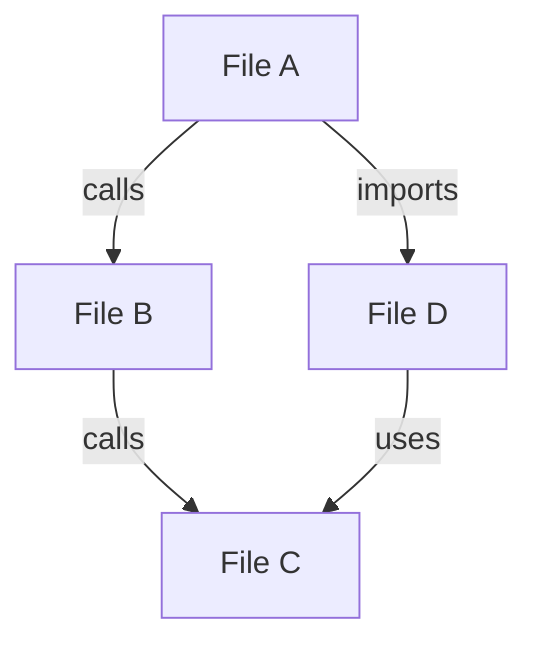

### 4.2 [Code Property Graphs (CPG)](https://arxiv.org/pdf/2507.16585)

**Approach** Use tools like Joern to extract vulnerability-relevant slices of
code.

**Benefits**

- Reduces effective code size by up to ~90%.
- Preserves semantic and security-critical context.

**Limitations**

- Requires DSL-aware or fine-tuned models.

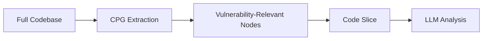

## 5. Optimization & Reasoning Persistence

### 5.1 [KV-Cache](https://medium.com/@joaolages/kv-caching-explained-276520203249) Optimization

To reduce Time-to-First-Token (TTFT) and inference costs:

- Keep prompt prefixes stable.
- Ensure context is append-only.

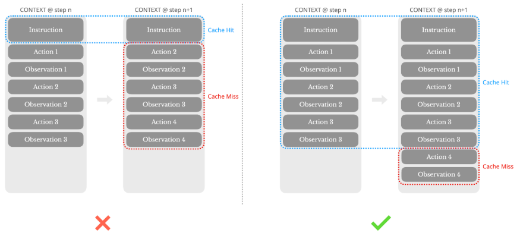

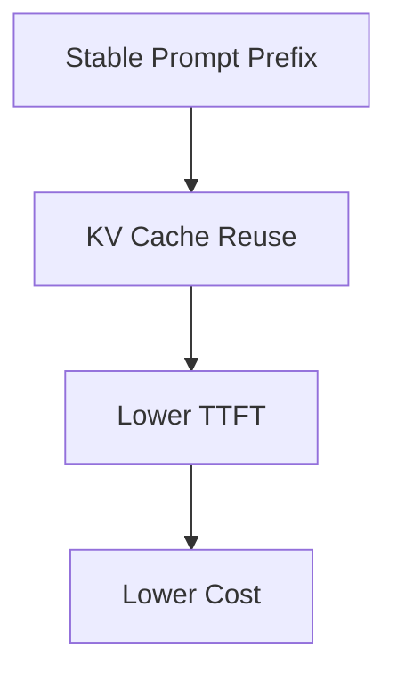

### 5.2 Context Engineering Techniques

**History Management**

- Maintain full logical history.
- Collapse or summarize older turns.
- Keep only the last N agent responses in full.

**Filesystem-Based Memory**

- Store large or compressed artifacts in files.
- Reference them by path in the prompt.
- Avoid lossy summarization.

**Recitation
([Manus Method](https://manus.im/blog/Context-Engineering-for-AI-Agents-Lessons-from-Building-Manus))**

- Continuously rewrite a concise “to-do list” at the end of the context.
- Push global objectives into the model’s recency window.
- Prevent task drift.

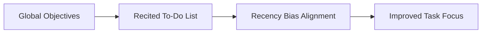

## 6. Summary

Long-context failures are a structural limitation of current LLMs, not simply a
matter of context window size.

Systems that combine:

- Context pruning,
- Agent-based exploration,
- Graph-based representations,
- KV-cache–aware prompting,
- And recency-aligned objectives,

can achieve significantly higher accuracy, lower cost, and better alignment in
complex auditing and code analysis workflows.
