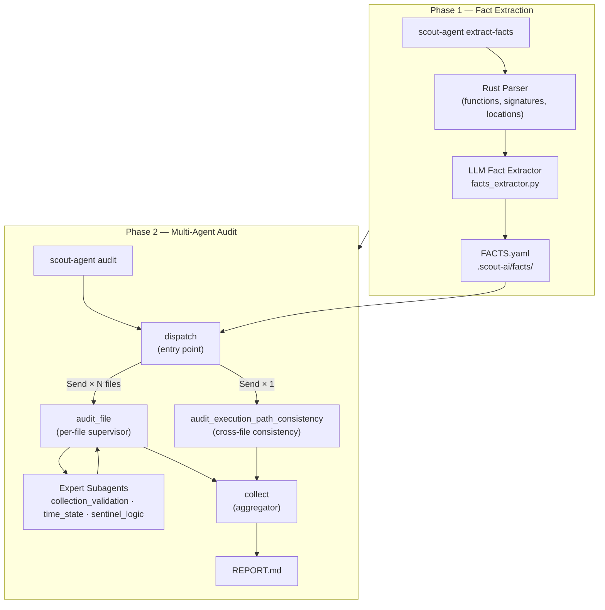

# Architectural Documentation: Scout-Agent

## Overview

**Scout-Agent** is an autonomous, AI-powered auditing system purpose-built for Soroban smart contracts. It combines static code analysis with a team of specialized LLM agents to identify security vulnerabilities across an entire repository, producing a structured, human-readable report.

Soroban smart contracts, written in Rust, are increasingly used to govern critical financial logic on the Stellar blockchain. Vulnerabilities in these contracts — such as missing input validation, inconsistent state mutation, or improper sentinel-value handling — can lead to significant financial loss or exploitation.

---

## 1. System Architecture

The system operates in two sequential phases: **Fact Extraction** and **Multi-Agent Audit**.

---

## 2. Phase 1: Fact Extraction

**Trigger:** `scout-agent extract-facts <project_root>`

The fact extraction phase pre-processes the target repository to build a lightweight semantic index of the codebase. This allows the audit agents to work efficiently without reading every line of every file.

**Process:**

1. A Rust-aware parser traverses the project and identifies all functions, their signatures, and source locations.
2. An LLM-assisted extractor (`facts_extractor.py`) reads each function and generates a structured summary.
3. The summaries are persisted as `FACTS.yaml` files under `.scout-ai/facts/`, one per source file.

**Extracted facts include:**

- Authorization checks (e.g., which functions enforce caller permissions)
- Storage mutations (e.g., which functions write to persistent state)
- Vector and array parameters (potential sources of missing validation)
- Sentinel value usage (e.g., `u32::MAX` as a special-status constant)

---

## 3. Phase 2: Multi-Agent Audit

**Trigger:** `scout-agent audit <project_root>`

The audit phase orchestrates a team of LLM agents using a [LangGraph](https://github.com/langchain-ai/langgraph) state machine. Files are audited in parallel; a separate agent performs cross-file consistency analysis concurrently.

### 3.1 Audit Graph (`graph.py`)

The graph implements a **fan-out / fan-in** pattern:

| Node                               | Role                                                                      |
| ---------------------------------- | ------------------------------------------------------------------------- |
| `dispatch`                         | Entry point; routes work to parallel nodes via a conditional fan-out edge |
| `audit_file`                       | Per-file supervisor; spawned once per file in scope, runs in parallel     |
| `audit_execution_path_consistency` | Repository-wide consistency agent; runs in parallel with file audits      |
| `collect`                          | Aggregator; merges findings and updated state from all parallel branches  |

### 3.2 Per-File Supervisor (`runners.py`)

Each `audit_file` node instantiates a **supervisor agent** using the `deepagents.create_deep_agent` framework. The supervisor is responsible for auditing a single file and delegates specialized checks to Expert Subagents.

**Tools available to the supervisor:**

- `read_file` — scoped to the target file, with line limits (100–500 lines) to maintain focus
- `grep` — powered by [ripgrep](https://github.com/BurntSushi/ripgrep) for fast repository-wide search

**Expert Subagents** (`experts.py`):

| Expert                  | Responsibility                                                                    |
| ----------------------- | --------------------------------------------------------------------------------- |
| `collection_validation` | Audits `Vec` and array inputs for missing uniqueness or duplicate-safe validation |
| `time_state`            | Audits time-dependent state transitions and ordering logic                        |
| `sentinel_logic`        | Audits use of special constants (e.g., `u32::MAX`) as status sentinels            |

Each expert has its own tools (`read_file`, `grep`) and produces a structured `ExpertResult`.

### 3.3 Execution Path Consistency (EPC) Agent

The EPC agent runs as a **first-class, parallel node** in the main graph, separate from the per-file supervisors. This design reflects its repository-wide scope — it cannot be confined to a single file.

**Capabilities:**

- Uses the aggregated `FACTS.yaml` data to locate all functions that modify a given state variable
- Audits all execution paths leading to those mutations to verify consistent validation logic
- Operates exclusively via `grep` (no direct file reads), keeping it efficient across large codebases

---

## 4. Resilience & State Management

### Checkpointing & Resume

All agent state is persisted to SQLite after each step:

- **Graph-level checkpoint** (`.scout-ai/memory.sqlite`): tracks which files have been reviewed and the overall `AuditState`. If an audit is interrupted, it resumes from the last checkpoint — already-reviewed files are skipped automatically.
- **Agent-level checkpoint** (`.scout-ai/.audit_memory.sqlite`): maintains per-agent conversation memory, allowing individual agent runs to be replayed.

### Retry Mechanism

Failed file audits are not silently discarded. The system classifies failures:

- **Toxic failures** (e.g., structured output parsing errors, policy violations): the file is retried in a new generation with a fresh agent context.
- **Non-toxic failures**: the error is logged and the audit continues with partial results, preventing a single failure from blocking the full report.

### Parallelism Control

The `max_concurrency` setting limits how many file audits run simultaneously, allowing the system to be tuned for the rate limits of the underlying LLM provider.

---

## 5. Output

At the end of a successful audit, Scout-Agent produces a `REPORT.md` in the project directory. The report contains:

- A list of verified findings, each with:
  - A human-readable description of the vulnerability
  - The source file and line number (relative to the project root)
  - Severity classification
- A summary of files reviewed and any failures encountered

Sample reports for reference contracts are available in `docs/results/`.

---

## 6. Key Design Decisions

| Decision                                  | Rationale                                                                                                                |
| ----------------------------------------- | ------------------------------------------------------------------------------------------------------------------------ |
| **Two-phase execution**                   | Fact extraction decouples static analysis from LLM inference, reducing token usage and improving agent focus             |
| **Fan-out parallelism**                   | Files are audited concurrently via LangGraph `Send`, dramatically reducing wall-clock time on large repos                |
| **DeepAgent wrapper for file supervisor** | Manages the Supervisor → Expert delegation lifecycle within a single graph node, avoiding complex nested graph wiring    |
| **EPC as a first-class graph node**       | Elevating cross-file consistency to a top-level node gives it full repo scope and runs concurrently with per-file audits |
| **Read limits on `read_file`**            | Strict line caps prevent context window overflow and force agents to read purposefully, improving output quality         |
